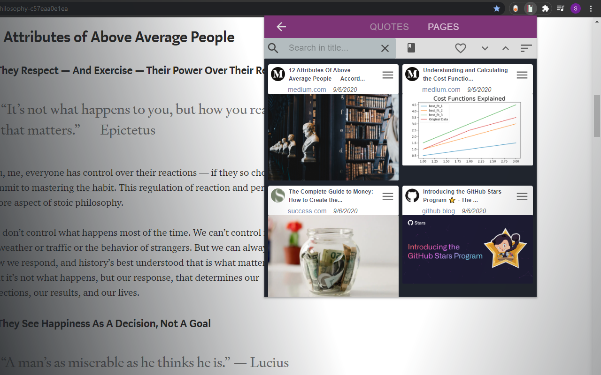
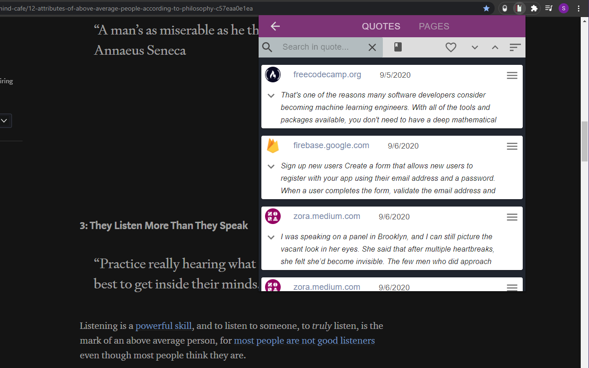

## Bookmarks extension

---

Chrome extension which allows to save bookmarks and quotes from visited websites. Created with React and Firebase after little adoption to chrome extension's standard's.

### Functionality

---

Extension can be downloaded from official chrome store [HERE](https://chrome.google.com/webstore/detail/bookmarks-manager/edkjmphnjejjmikmpiakkmlgkflebhgc?hl=en-GB&authuser=1) but due to some problems (app requires to be logged into chrome and having enabled sync) it has some difficulties to work properly in browser environment. Nonetheless the code is fully working and it's a good base for creating chrome extensions with React

### Installation and setup

---

After creating database with Firebase, adding database config to app and setting chrome security rules in manifest, app can be build with `npm run build` and loaded to chrome via `load unpacked`.

Due to specific chrome files, app will throw an error during running via `npm start`

As mentioned before extension require being logged into chrome and having enabled sync in settings

### Technologies

---

- React 16.13.1
- Material-ui 4.11.0 with icons
- Firebase 7.17.1
- Chrome extension dependencies
- React router 5.2
- React-share

